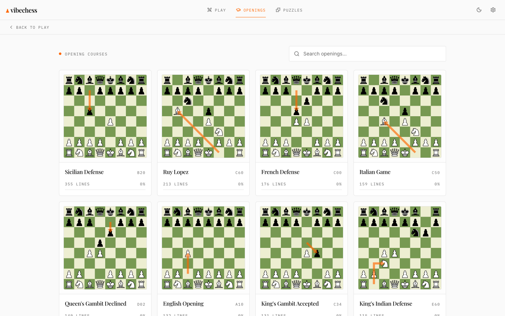
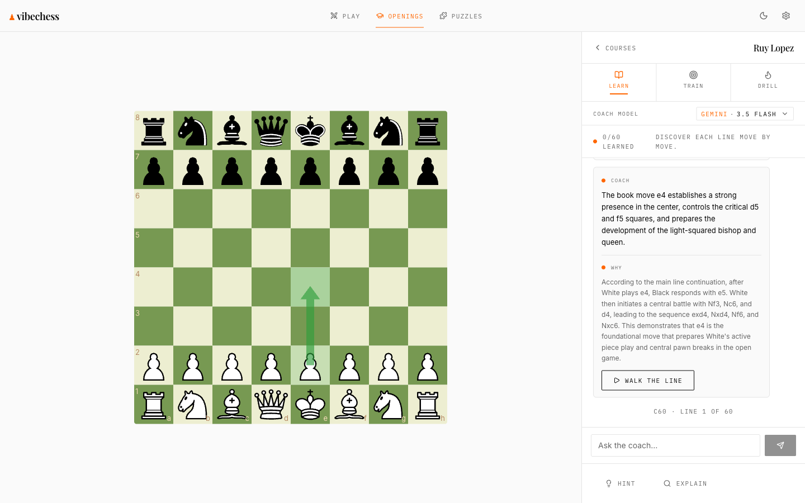
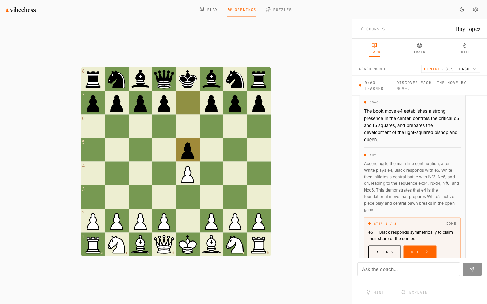
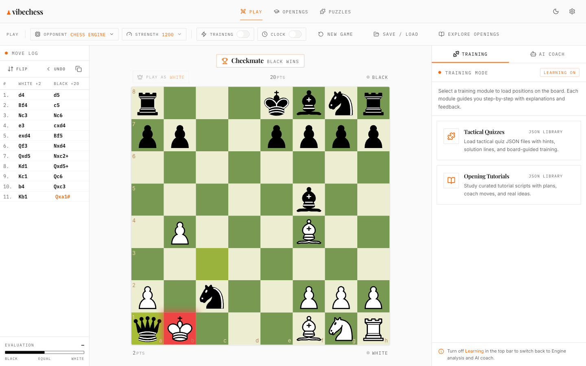
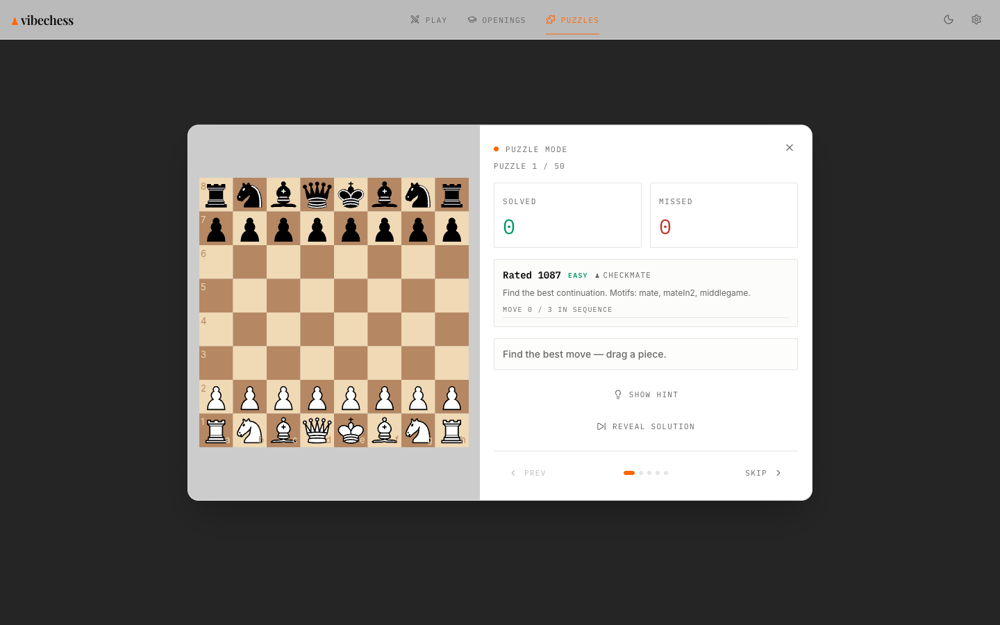

<div align="center">

# ♟ vibechess

### Your AI chess grandmaster, in the browser

Most chess apps show you the **best move**.
**vibechess explains *why* it is best**, draws the idea on the board, and walks you through the opponent's plan one move at a time.

A grounded Stockfish coach plus a spaced repetition openings trainer, running entirely client side. No engine server, ever.

[](https://react.dev)
[](https://vite.dev)
[](https://tailwindcss.com)
[](https://stockfishchess.org)
[](https://ai.google.dev)
[](https://platform.openai.com)

</div>

---

<div align="center">
  
  <br/><sub><b>Opening courses built from real Lichess lines, each card a characteristic position with its plan drawn on.</b></sub>
</div>

---

## What makes it different

The coach never guesses. Every explanation is **grounded in the engine**: vibechess runs Stockfish on the position, takes the real principal variation, and only then asks the language model to put that evidence into a grandmaster's words. The model annotates moves; it never invents them. Turn the key off and you still get a full engine grounded explanation from built in templates.

| | |
|---|---|
| 🧠 **Grounded coaching** | Stockfish supplies the truth (best line, evaluation, tactics). The AI verbalizes it. Moves shown on the board are always the engine's, never hallucinated. |
| 💬 **One chat, like a real lesson** | Explanations, wrong move corrections, and your follow up questions all live in a single conversation. Ask anything about the position and the coach answers, grounded in the current board. |
| 👣 **Walk the line, move by move** | Step manually through the book line with Prev and Next. Each move carries a one sentence reason, including what the **opponent** is trying to do, generated for the whole line in a single call. |
| 🔁 **Spaced repetition openings** | A chessreps style trainer over a real move tree, scheduled with FSRS so you review each line exactly when you are about to forget it. |
| ♟ **100% in the browser** | Stockfish 18 runs as WebAssembly on your machine. Maia gives human like sparring. No backend computes a single move. |
| 🔑 **Bring your own key** | Add a Gemini or OpenAI key in Settings for AI coaching. It is stored only in your browser and never touches a server. The app is fully usable without one. |

---

## Screenshots

<table>
  <tr>
    <td width="50%" align="center">
      
      <br/><sub><b>The grounded coach</b><br/>A clear idea, a deeper "why", and a button to walk the line.</sub>
    </td>
    <td width="50%" align="center">
      
      <br/><sub><b>Walk the line</b><br/>Manual step through, each move explained, the opponent's plan included.</sub>
    </td>
  </tr>
  <tr>
    <td width="50%" align="center">
      
      <br/><sub><b>Play and analyze</b><br/>Live game, move log, evaluation bar, and the coach on the side.</sub>
    </td>
    <td width="50%" align="center">
      
      <br/><sub><b>Puzzle trainer</b><br/>Rated tactics with motifs, hints, and a solution walkthrough.</sub>
    </td>
  </tr>
</table>

---

## How the coach stays honest

```
position  ─▶  Stockfish 18 (WASM)  ─▶  evidence: best line, eval phrase, tactics
                                          │
                                          ▼
                              one LLM call (Gemini / GPT)
                                          │
            ┌─────────────────────────────┼─────────────────────────────┐
            ▼                             ▼                             ▼
      explanation                    why paragraph              steps: [{move, note}]
   (the single big idea)         (cites the real line)     (one reason per engine move)
            │                             │                             │
            └─────────────────────────────┴─────────────────────────────┘
                                          ▼
                       board arrows + highlights computed in code
                  (green = book move, red = your mistake, never the model)
```

If there is no key, or the model is rate limited or slow, vibechess falls back to a built in, engine grounded explanation within a couple of seconds. The board arrows and the demonstration line are computed in code regardless, so the position is never left unexplained.

---

## Tech stack

- **Frontend:** Vite 7, React 19, plain JSX, Tailwind CSS 4 (editorial design system, semantic tokens only)
- **Engine:** Stockfish 18 lite, single threaded WebAssembly, in browser. Maia via Zerofish for human like play
- **Chess core:** `chess.js` for rules and SAN, `react-chessboard` for the board
- **AI coach:** Google Gemini (`gemini-3.5-flash` default) and OpenAI (`gpt-5.4-mini` default), called directly with the user's own key
- **Auth + data:** Clerk for accounts, Supabase (Postgres + RLS) for cross device sync. Without them the app runs anonymously on IndexedDB
- **Openings trainer:** `ts-fsrs` scheduler over a move tree ingested from Lichess CC0 opening data
- **Tests:** Vitest

---

## Getting started

```bash
git clone https://github.com/achammah/vibechess.git
cd vibechess
npm install
npm run dev
```

Open http://localhost:5173. That is it. **The app runs out of the box, anonymously, with the engine and the trainer fully working.**

To enable AI coaching, open **Settings** in the app and paste a Google Gemini key (free at [aistudio.google.com](https://aistudio.google.com/apikey)) or an OpenAI key. The key lives only in your browser.

### Optional: accounts and cloud sync

Copy `.env.example` to `.env.local` and fill in the values to turn on Clerk accounts and Supabase sync:

```bash
cp .env.example .env.local
```

| Variable | Purpose |
|---|---|
| `VITE_CLERK_PUBLISHABLE_KEY` | Clerk auth (Dashboard → API Keys) |
| `VITE_SUPABASE_URL` | Supabase project URL |
| `VITE_SUPABASE_PUBLISHABLE_KEY` | Supabase publishable / anon key |

Every client variable must be prefixed `VITE_`. Server only keys (for ingestion and migrations) are never prefixed.

### Optional: load the data sets

With Supabase configured, populate the openings move tree and puzzles:

```bash
npm run db:migrate            # apply the schema
npm run db:ingest-openings    # Lichess CC0 opening lines into the move tree
npm run db:ingest-puzzles     # Lichess CC0 rated puzzles
```

---

## Scripts

| Command | Does |
|---|---|
| `npm run dev` | Start the dev server |
| `npm run build` | Production build |
| `npm run preview` | Preview the production build |
| `npm test` | Run the test suite (Vitest) |
| `npm run lint` | Lint with ESLint |
| `npm run format` | Format with Prettier |

---

## Credits

vibechess began as a fork of [**Iamsdt/chess**](https://github.com/Iamsdt/chess) and was extended with the grounded coach, the single chat trainer, the FSRS openings tree, Clerk and Supabase, and the editorial redesign. It stands on:

- [Stockfish](https://stockfishchess.org) for engine analysis
- [Lichess](https://database.lichess.org) for CC0 opening and puzzle data
- [Maia Chess](https://maiachess.com) for human like play
- [chess.js](https://github.com/jhlywa/chess.js) and [react-chessboard](https://github.com/Clariity/react-chessboard)

---

<div align="center">
<sub>Built with Stockfish, a little AI, and a lot of respect for the game.</sub>
</div>
